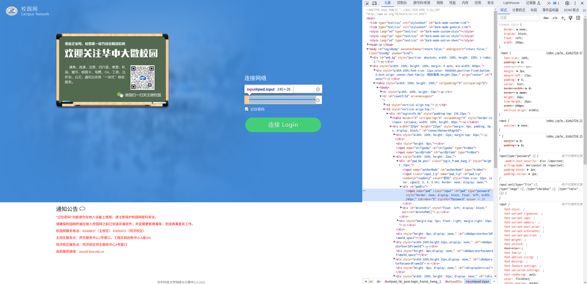

把 [hust-network-login](https://github.com/black-binary/hust-network-login) 用 shell 抄了一遍

# HUST-Network-Login-sh

极简主义的华中科技大学校园网络认证工具，支持有线和无线网络。下载即用，大小约为 2.1k，有依赖。为路由器等嵌入式设备开发，支持所有带
posix shell 和 unix2dos、nc 等工具的主流硬件软件平台。No Python, Has Dependencies, Is Bullshit.

## 使用

src/main.sh 是可执行文件。

配置文件只有两行, 第一行为用户名，第二行为密码，例如

```text
M2020123123
mypasswordmypassword
```

保存为 my.conf

然后运行

```shell
./hust-network-login-sh ./my.conf
```

my.conf 是刚才的配置文件，你可以换成其他名字。

连接成功后，程序将会每间隔 15s 测试一次网络连通性。如果无法连接则进行重新登陆。

## 编译

编译本地平台只需要使用 `cp`。

```shell
cp src/main.sh ./hust-network-login-sh
```

## 依赖

`nc` `unix2dos` `awk` `grep` `printf` `sed` `sleep` `od` `bc` 以及一个 POSIX 兼容的 `sh`。

如果你的 shell 没有 `od` 与 `bc`，也可使用加密完成后的密码

## 加密密码获取方式

在校园网登录时勾选记住密码，下次登录时密码框会默认填充加密后的密码，浏览器中按下 `F12`
打开开发者工具，选择密码框的 `<input>` 标签，双击 `type="password"` 将其修改为 `type="text"` 即可显示加密后的密码，直接复制粘贴到配置文件中即可



或者在控制台直接输入

```js
document.querySelector("#pwd").value
```

即可输出加密后密码（截图中密码已作处理）


或者也可以使用我们提供的密码加密脚本，./scripts/encrypt.sh。

假设你的密码是 mypassword，你可以这么用它：

```plain
jyi-station 17:58 (master) ~/dev/hust-network-login-sh
0 ./scripts/encrypt.sh mypassword
26893ab982eba6463f1e8096c01acd779577b9e0d20a8473ffdae1a96b5c9c076df332cc55b22cacc29aade2a38a749a6a9a1e11a4dbee2849f5ca17a7f61d7338beaebe4f14b732e4245086c48cbc247a4e6e28d12febdafd4d7d07535ebd6e43d0562903a3ec15f1c91ec573a2b33cd2c0d8606995c9cc7a90ee9867b91323
```

脚本的输出即为加密后的密码。

## 相似项目

* 项目起源：[hust-network-login](https://github.com/black-binary/hust-network-login)
* 面向基于 busybox 的路由器的版本：[hust-network-login-sh](https://github.com/jyi2ya/hust-network-login-sh)
* 面向 MCU arduino 的嵌入式的版本：[hust-network-login-esp](https://github.com/vaaandark/hust-network-login-esp)
